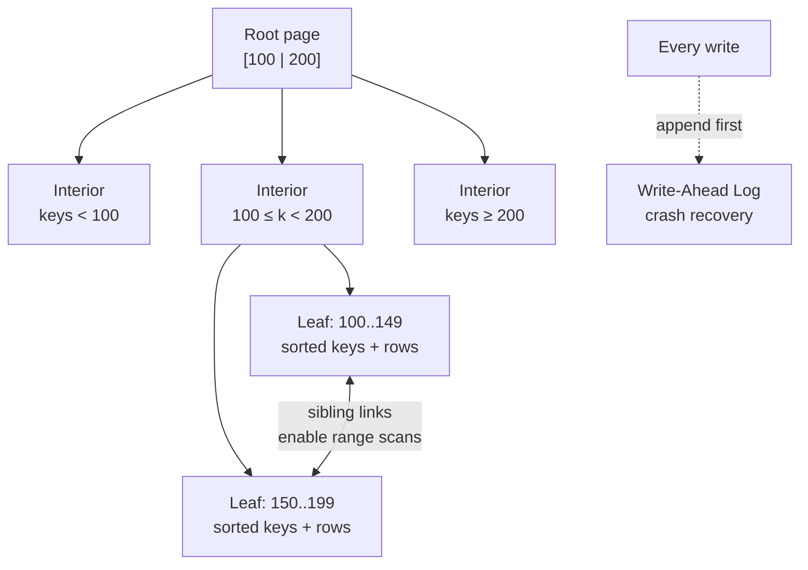

The **B-tree** is the index structure behind Postgres, MySQL (InnoDB), Oracle, and SQL Server — if you've ever run `CREATE INDEX`, you almost certainly built one.

A B-tree breaks the database into fixed-size **pages** (typically 4-16 KB, matching disk block sizes) and organizes them as a balanced tree:

- **Interior pages** hold sorted keys acting as signposts: "keys < 100 → child A, 100-200 → child B, ..."
- **Leaf pages** hold the actual keys in sorted order, with either the row data inline (clustered index) or references to it.

The magic is the **branching factor**. A 4 KB page holds hundreds of keys, so each page has hundreds of children. A tree of depth 4 with branching factor 500 addresses 500⁴ = **62 billion keys** — meaning any lookup costs at most 4 page reads, and the top levels are invariably cached in memory.

Unlike the append-only hash index design, B-trees **update pages in place**. That raises two problems:

1. **Page overflow**: inserting into a full page forces a **page split** — allocate two pages, redistribute keys, update the parent (which may split too, recursively up to the root; this is how the tree grows *taller*).
2. **Crash safety**: a crash mid-split can corrupt the tree. Databases solve this with a **write-ahead log (WAL)**: every modification is appended to the WAL *before* the page is touched, so recovery replays the log.

Explain the structure of a B-tree, how lookups/inserts/range queries work, and how it stays crash-safe.

## Solution

```js
// ════════════════════════════════════════════
// B-tree operations (conceptual)
// ════════════════════════════════════════════

const PAGE_SIZE = 4096;      // bytes — matches disk block
const BRANCHING = 500;       // keys per page (realistic order)

function lookup(root, key) {
  let page = root;
  while (!page.isLeaf) {
    // binary search the sorted signpost keys — in memory, cheap
    page = page.childFor(key);      // 1 disk read per level
  }
  return page.find(key);            // depth 3-4 even for billions of keys
}

function insert(root, key, value) {
  wal.append({ op: 'insert', key, value }); // WAL FIRST — crash safety
  const leaf = descendToLeaf(root, key);
  leaf.insertSorted(key, value);            // in-place page update

  if (leaf.isFull()) {
    // Page split: half the keys move to a new page,
    // parent gets a new signpost. May cascade upward;
    // splitting the root makes the tree one level taller.
    split(leaf);
  }
}

function rangeQuery(root, from, to) {
  // THE killer feature hash indexes lack:
  let page = descendToLeaf(root, from);  // O(log n) to find start
  const results = [];
  while (page && page.minKey <= to) {
    results.push(...page.entriesBetween(from, to));
    page = page.nextLeaf;   // leaves are linked in sorted order —
  }                         // just walk siblings. O(log n + k)
  return results;
}

// ════════════════════════════════════════════
// Crash safety: the write-ahead log
// ════════════════════════════════════════════
// Problem:  a page split touches 3+ pages; power loss midway
//           leaves the tree corrupted (orphaned children).
// Solution: append every intended change to a sequential log
//           BEFORE modifying any page. On restart, replay the
//           WAL to restore consistency.
// Note the irony: to make the update-in-place structure safe,
// B-trees bolt on an append-only log — the LSM tree (next
// lesson) takes that idea and makes the log the whole database.

// ════════════════════════════════════════════
// B-tree vs hash index
// ════════════════════════════════════════════
// Point lookup:   O(log n) ~ 3-4 page reads   vs  O(1)
// Range query:    excellent (sorted leaves)   vs  impossible
// Keys in RAM:    only top levels needed      vs  ALL keys
// Write cost:     page write (+ splits + WAL) vs  append
```

## Explanation

Why not a binary search tree? **Depth.** A balanced BST over 1 billion keys is ~30 levels deep — 30 disk reads per lookup. The B-tree's insight is to match the tree node to the disk's natural unit (the page) and pack hundreds of keys into each node, collapsing 30 levels into 3-4. Fewer, fatter nodes = fewer disk seeks. That single idea has kept B-trees dominant since 1970.

**Range queries** are the differentiator to emphasize in interviews. Leaf pages store keys in sorted order and are linked like a linked list, so `BETWEEN`, `ORDER BY ... LIMIT`, and prefix scans are: descend once, then walk siblings sequentially. This is why relational databases default to B-trees rather than hash indexes — most real query patterns involve ordering or ranges somewhere.

**Writes are the weak spot.** Every write pays: WAL append + page read-modify-write, plus occasional splits touching multiple pages. A single logical write becoming multiple physical writes is called **write amplification**, and it's the opening for the LSM tree (next lesson), which buffers writes in memory and defers disk work. The rough performance folklore: **B-trees read faster, LSM trees write faster** — you'll refine that in the lessons ahead.

Also worth knowing: **concurrency**. In-place updates mean readers can observe a page mid-modification, so B-trees need careful latching (lightweight page locks) — one more cost of mutability that immutable-segment designs sidestep.

## Diagram



## ELI5

Think of a giant filing system for every person in the country, organized as three questions.

You walk in and ask for "Nguyen." The lobby sign (root page) says: "A-H → Building 1, I-P → Building 2, Q-Z → Building 3." Inside Building 2, a sign says which floor. On that floor, one cabinet drawer holds "Ng-Nz" — everyone sorted alphabetically. Three signs, one drawer: whether the system holds a thousand people or a billion, it's still just 3-4 hops, because each sign lists *hundreds* of options.

Want everyone from "Nguyen" to "Patel"? Find Nguyen's drawer, then just keep opening the *next* drawers in order — they're sorted and connected. (The sticky-note board from last lesson could never do this — its notes are shuffled randomly.)

The catch: files get updated *in place*, and when a drawer overflows, a clerk must split it into two and update the floor sign. If the power dies mid-split, files could be lost — so clerks first scribble every planned change in a diary (the write-ahead log). After a blackout, they replay the diary to fix any half-finished work.
