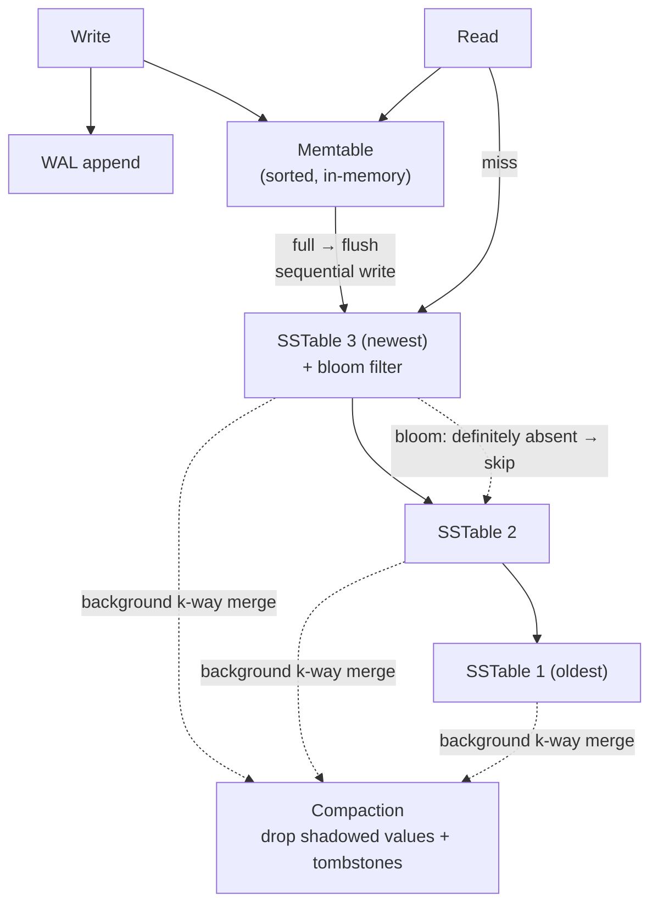

The **Log-Structured Merge tree** powers Cassandra, RocksDB, LevelDB, HBase, and ScyllaDB — the databases you reach for in write-heavy designs. It combines the hash index's insight (sequential writes are fast) with the B-tree's (sorted keys enable ranges and let indexes be sparse).

**The write path:**
1. Append to a **WAL** (crash recovery), then insert into the **memtable** — an in-memory balanced tree (red-black/AVL/skip list) keeping keys sorted. No disk page updates at all.
2. When the memtable hits a threshold (~a few MB), flush it to disk as an **SSTable** (Sorted String Table): an *immutable* file of key-value pairs in sorted order. Sequential write, done in the background while a fresh memtable accepts new writes.

**The read path** (the price you pay):
1. Check the memtable.
2. Miss? Check SSTables **newest to oldest** — the first hit wins (newer data shadows older).
3. A key that doesn't exist means checking *every* SSTable. Fix: each SSTable carries a **bloom filter** — a probabilistic structure that says "definitely not here" or "maybe here" — so most files are skipped without touching disk.

Because SSTables are sorted, each needs only a **sparse index** (one entry per few KB — binary search the neighborhood), and lookups within a table are O(log n).

**Compaction** keeps read costs bounded: background threads merge SSTables (a k-way merge, like mergesort's merge step — cheap because inputs are sorted), dropping shadowed values and tombstoned deletes.

Explain the LSM write path, read path, and the role of bloom filters and compaction.

## Solution

```js
// ════════════════════════════════════════════
// LSM tree engine (conceptual)
// ════════════════════════════════════════════

class LSMTree {
  constructor() {
    this.memtable = new SortedTree();  // in-memory, keys sorted
    this.sstables = [];                // on disk, newest first
    this.MEMTABLE_LIMIT = 4 * 1024 * 1024; // ~4 MB
  }

  set(key, value) {
    wal.append({ key, value });        // crash safety
    this.memtable.insert(key, value);  // O(log n) in MEMORY — no disk pages

    if (this.memtable.sizeBytes() > this.MEMTABLE_LIMIT) {
      this.flush();                    // background, non-blocking
    }
  }

  flush() {
    // Memtable is already sorted → write it out in one
    // sequential pass as an immutable SSTable.
    const sst = {
      entries: this.memtable.toSortedArray(),
      bloom: BloomFilter.from(this.memtable.keys()),
      sparseIndex: buildSparseIndex(this.memtable), // 1 entry per block
    };
    this.sstables.unshift(sst);        // newest first
    this.memtable = new SortedTree();  // fresh memtable
    wal.truncate();                    // flushed data is durable now
  }

  get(key) {
    // 1. memtable — most recent data
    const hit = this.memtable.find(key);
    if (hit !== undefined) return unwrapTombstone(hit);

    // 2. SSTables newest → oldest; first hit wins
    for (const sst of this.sstables) {
      if (!sst.bloom.mightContain(key)) continue; // skip file, no I/O!
      const block = sst.sparseIndex.blockFor(key); // binary search
      const found = scanBlock(block, key);
      if (found !== undefined) return unwrapTombstone(found);
    }
    return null;
  }

  delete(key) {
    this.set(key, TOMBSTONE); // shadows older values until compacted away
  }

  // ── Background compaction ──────────────────
  compact(tables) {
    // k-way merge of sorted files — streaming, O(total entries).
    // Keep only the NEWEST value per key; drop tombstones
    // once no older table can contain the key.
    const merged = kWayMerge(tables, { keepNewestPerKey: true });
    // atomically replace `tables` with `merged`
  }
}

// ════════════════════════════════════════════
// Trade-off vs B-tree
// ════════════════════════════════════════════
// Writes:  memory insert + sequential flush   >>  in-place page writes
// Reads:   possibly several files (bloom-mitigated)  <  3-4 page reads
// Ranges:  supported (sorted), but must merge across tables
// Space:   duplicates exist until compaction runs
// Beware:  compaction competes with live traffic for disk I/O;
//          badly tuned compaction stalls writes entirely.
```

## Explanation

The core trick is **converting random writes into sequential ones**. A B-tree write must find and rewrite a specific 4 KB page somewhere on disk (random I/O, plus potential splits). An LSM write touches memory plus an append-only WAL, and disk sees only occasional large sequential flushes — the access pattern disks and SSDs love. This is why write-heavy systems (metrics, event logs, chat messages, time-series) overwhelmingly sit on LSM engines.

The read path is where interviewers probe. Worst case, a point read checks the memtable and every SSTable. Two mechanisms keep this sane: **bloom filters** (a few bits per key answering "definitely absent / maybe present" — false positives possible, false negatives never — eliminating disk reads for most non-matching files) and **compaction** (bounding the number of files). Compaction strategies are a real tuning decision: **size-tiered** (merge similar-sized tables; write-optimized, Cassandra's default) vs **leveled** (organize into levels with non-overlapping key ranges; read-optimized, RocksDB/LevelDB's default).

Note the elegant role reversal from the previous lesson: a B-tree is an update-in-place structure that bolts on a log for safety; an LSM tree *is* a log, structured with sorted files for searchability. And unlike hash indexes, the sparse index means keys do **not** all need to fit in RAM, and sorted SSTables mean **range queries work**.

Weaknesses to volunteer before being asked: read amplification for point lookups of cold or absent keys, compaction I/O competing with foreground traffic (tail-latency spikes when it falls behind), and space amplification from not-yet-compacted duplicates.

## Diagram



## ELI5

You're taking meeting notes all day. Filing every sentence into the office's giant alphabetized cabinets the moment you write it (the B-tree way) would be painfully slow — so instead you keep a **desk notepad** (memtable) and jot things instantly, keeping the notepad's entries alphabetized as you go.

When the notepad fills up, you copy it — already alphabetized — into a **sealed folder** (SSTable) and drop it in the archive, then grab a fresh notepad. Sealing a whole folder at once is fast; you never squeeze pages into old folders.

To find something, check the notepad first, then folders **newest to oldest** — newer notes override older ones. To avoid opening folder after folder, each has a **checklist on its cover** (bloom filter): "Is 'Project X' possibly in here?" If the cover says no, skip the folder without opening it.

Every so often, a coworker merges old folders into one, tossing outdated notes and anything marked "deleted" (compaction). Result: writing is always instant, and reading stays reasonably quick — as long as the merging keeps up.
