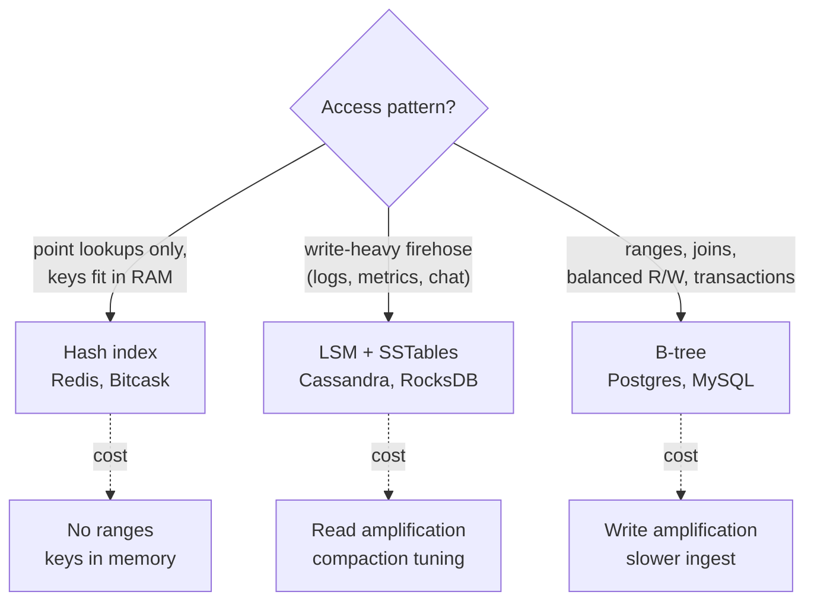

You now know the three index families that underpin practically every database. This lesson consolidates them into the comparison you'll actually use in interviews — because "I'd use Postgres here" earns a follow-up of *why*, and the honest answer is usually about the storage engine.

**The three families:**

| | Hash index | B-tree | LSM tree + SSTables |
|---|---|---|---|
| Point read | O(1), best | 3-4 page reads | Memtable + bloom-filtered SSTables |
| Range query | ✗ impossible | ✓ excellent | ✓ good (merge across tables) |
| Write | Append, very fast | In-place page write + WAL | Memory + sequential flush, fastest at scale |
| Memory need | ALL keys in RAM | Top pages only | Memtable + bloom filters + sparse indexes |
| Found in | Bitcask/Riak, Redis | Postgres, MySQL, Oracle | Cassandra, RocksDB, HBase, LevelDB |

**Amplification vocabulary** (senior-level signaling):
- **Read amplification** — extra work per logical read (LSM: checking several SSTables).
- **Write amplification** — extra physical writes per logical write (B-tree: WAL + page rewrite + splits; LSM: rewriting data during every compaction pass).
- **Space amplification** — extra bytes stored (LSM: uncompacted duplicates; B-tree: half-empty pages from splits).

No structure wins all three — every engine picks its poison.

Given a workload description, choose an index structure and justify it.

## Solution

```js
// ════════════════════════════════════════════
// Decision procedure for interviews
// ════════════════════════════════════════════

function chooseIndex(workload) {
  // 1. Pure point lookups on a bounded, hot key set?
  //    e.g. session store, counters, cache
  if (workload.pointLookupsOnly && workload.keysFitInRAM) {
    return 'Hash index (Redis, Riak/Bitcask)';
  }

  // 2. Write-heavy firehose? Metrics, events, messages, IoT,
  //    time-series, activity feeds…
  if (workload.writeQPS > workload.readQPS) {
    return 'LSM engine (Cassandra, RocksDB, HBase)';
    // Justify: sequential I/O, memtable absorbs bursts.
    // Mention the cost: read amplification + compaction tuning.
  }

  // 3. Everything else — balanced read/write, range queries,
  //    joins, transactions:
  return 'B-tree relational DB (Postgres, MySQL)';
  // The boring default is the right default. Say why:
  // predictable O(log n) reads, mature transactions, ranges.
}

// ════════════════════════════════════════════
// Secondary indexes — beyond the primary key
// ════════════════════════════════════════════
// CREATE INDEX ON users(email);
//
// Same structures, two storage choices for the "value":
//  - Clustered index: leaf holds the ROW ITSELF.
//    (InnoDB primary key; one per table — the data IS the tree)
//  - Non-clustered: leaf holds a POINTER/primary key; fetching
//    other columns needs a second lookup ("heap fetch").
//  - Covering index: index stores copies of the queried columns
//    → query answered entirely from the index. Fast reads,
//    more write amplification. The trade-off never disappears.

// ════════════════════════════════════════════
// Multi-column access?
// ════════════════════════════════════════════
// Composite index on (last_name, first_name):
//   sorts by last_name, then first_name within it.
//   Great for WHERE last='Le' AND first='Tom'
//   Great for WHERE last='Le'
//   USELESS for WHERE first='Tom'  ← column order matters!
```

## Explanation

The interview move this lesson enables: when you draw a database box, immediately attach the workload reasoning. *"Chat messages are append-mostly and write-heavy, so I'd use Cassandra — LSM storage turns that firehose into sequential I/O. The trade-off is read amplification, but reads here are 'recent messages by conversation,' which is one partition scan."* That two-sentence pattern — choice, mechanism, acknowledged cost — is the difference between name-dropping and understanding.

A few consolidating truths worth internalizing:

1. **Sorted vs scattered is the deepest divide.** B-trees and LSM trees both keep keys sorted — that's what buys range queries, prefix scans, and sparse indexing. Hashing buys O(1) by destroying order. Ask "will anyone ever query a range of these keys?" before hashing anything.

2. **Every index is a bet that reads outnumber writes on that column.** Secondary indexes multiply write cost — a table with five indexes pays five extra structure updates per insert. When an interviewer says "writes are bottlenecked," *dropping unused indexes* is a legitimate first answer.

3. **Real systems mix families.** Postgres is B-tree but its WAL is a log; Cassandra is LSM but its in-memory memtable is a balanced tree; Redis is a hash map with an append-only file. The families are building blocks, not brands.

## Diagram



## ELI5

Three ways to organize your closet:

**The sticky-note way (hash):** clothes stuffed anywhere, but a note on the door tells you exactly where each item is. Grabbing "the blue shirt" is instant. But "show me everything from summer" means reading every note — and a huge wardrobe needs more notes than the door can hold.

**The boutique way (B-tree):** everything hung in order, sections labeled. Finding one item takes a few sign-reads; grabbing "all shirts, small to large" is a single sweep. But putting laundry away is slow — every item must go to its exact spot, and full racks need reshuffling.

**The laundry-basket way (LSM):** toss clean clothes in a basket by the door (instant!). When it fills, sort *that basket* and shelve it as one sealed bin. Finding something means checking the basket, then bins newest-to-oldest — each bin has a contents list on top so you skip most. Weekend chore: merge old bins, discarding outgrown stuff.

None is "best." Grab-one-thing-fast household? Sticky notes. Browse-by-category? Boutique. Mountains of incoming laundry? Baskets and bins. Databases pick the same way — by how you'll use the closet.
