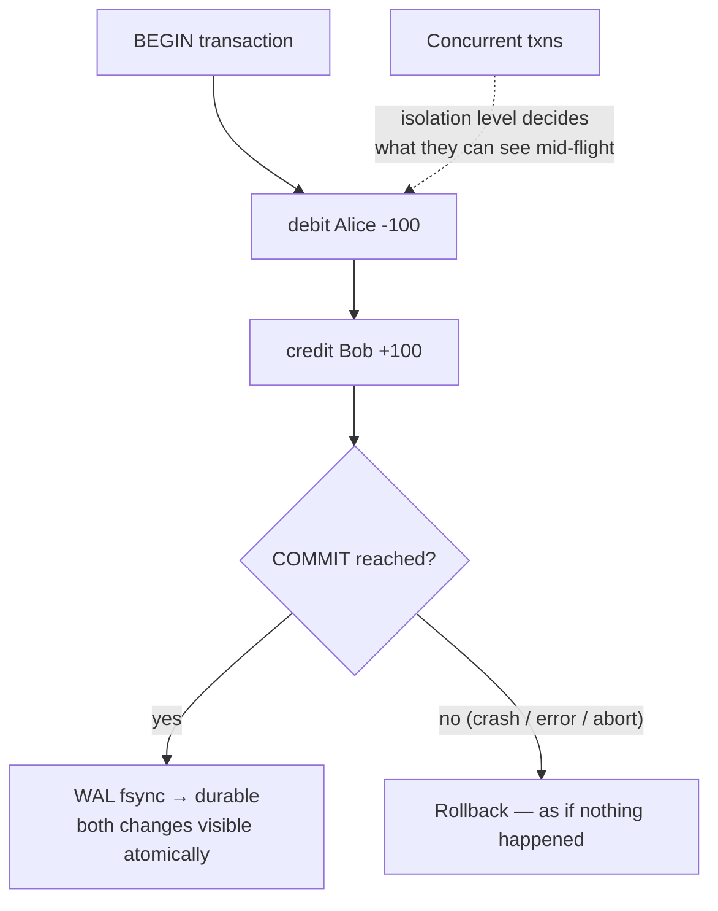

You're transferring $100 from Alice to Bob:

```sql
UPDATE accounts SET balance = balance - 100 WHERE name = 'Alice';
-- 💥 server crashes here
UPDATE accounts SET balance = balance + 100 WHERE name = 'Bob';
```

Alice lost $100 and Bob got nothing. **Transactions** exist to make this impossible: a transaction groups several reads and writes into one logical unit that either **commits** entirely or **aborts** leaving no trace. The guarantees are the famous **ACID** acronym:

- **Atomicity** — *all or nothing.* If anything fails mid-transaction (crash, constraint violation, deadlock), the database rolls back every change already made. Better named "abortability."
- **Consistency** — *invariants hold.* If your data was valid before (balances sum to a constant, foreign keys resolve), it's valid after. Really a property of your application's invariants that A, I, and D make preservable — the odd one out.
- **Isolation** — *concurrent transactions don't step on each other.* Formally, **serializability**: the outcome equals *some* one-at-a-time execution. In practice, full isolation is expensive, so databases default to weaker levels — the subject of the next several lessons.
- **Durability** — *committed data survives crashes.* Implemented with the write-ahead log: changes are fsynced to the WAL before the database ever says "committed."

Explain each ACID property, how it's implemented, and which one is negotiable in practice.

## Solution

```js
// ════════════════════════════════════════════
// The transfer, done right
// ════════════════════════════════════════════
// BEGIN;
//   UPDATE accounts SET balance = balance - 100 WHERE name='Alice';
//   UPDATE accounts SET balance = balance + 100 WHERE name='Bob';
// COMMIT;   -- both visible atomically, fsynced via WAL
//
// Crash between the updates? Recovery finds no COMMIT record
// in the WAL for this txn → rolls it back. Alice keeps her $100.

// ════════════════════════════════════════════
// What each letter buys you (and how)
// ════════════════════════════════════════════

const ACID = {
  atomicity: {
    threat: 'partial failure — crash halfway through',
    mechanism: 'WAL + rollback: undo uncommitted changes on recovery',
    withoutIt: 'application must manually detect and repair half-done writes',
  },

  consistency: {
    threat: 'invariant violations (sum of balances changes)',
    mechanism: 'constraints + the app using A/I/D correctly',
    note: 'a property of YOUR invariants — the database cannot invent them',
  },

  isolation: {
    threat: 'race conditions between concurrent transactions',
    mechanism: 'locks or MVCC — details define the isolation LEVEL',
    gotcha: 'most DBs default to WEAK isolation (e.g. Postgres: read committed)',
  },

  durability: {
    threat: 'committed data vanishing in a crash',
    mechanism: 'fsync WAL before acking COMMIT; replication for disk loss',
  },
};

// ════════════════════════════════════════════
// The classic race isolation prevents
// ════════════════════════════════════════════
// Counter increment, two concurrent requests, counter = 10:
//
//   T1: reads 10          T2: reads 10
//   T1: writes 11         T2: writes 11   ← lost update!
//
// Two increments, counter shows 11. Isolation levels are
// defined by which of these anomalies they prevent:
//   dirty read   — seeing another txn's UNCOMMITTED data
//   dirty write  — overwriting another txn's uncommitted data
//   read skew    — seeing different snapshots within one txn
//   lost update  — the race above
//   write skew   — two txns break an invariant TOGETHER
```

## Explanation

The interview trap with ACID is reciting the acronym without depth. What distinguishes strong answers:

**Atomicity is about failure, not concurrency.** People conflate A and I. Atomicity handles *crashes and errors* (undo half-done work); isolation handles *concurrent* transactions. The WAL does double duty — it's how atomicity (undo/rollback) and durability (redo after crash) are both implemented.

**Consistency is the odd one out.** Joe Hellerstein quipped it was in the acronym "to make it pronounceable." The database gives you tools (constraints, transactions); whether "money is conserved" holds is your application's invariant. Don't confuse it with the C in CAP, either — totally different concept.

**Isolation is negotiable — and that's the deep topic.** True serializability costs throughput, so real databases ship weaker defaults: Postgres and Oracle default to *read committed*, MySQL/InnoDB to *repeatable read*. That means the lost-update race in the solution can happen in production code *today* unless you handle it. The next lessons climb the isolation ladder: read committed → snapshot isolation → the anomalies that survive even there (write skew) → the three roads to full serializability (serial execution, two-phase locking, SSI).

**Durability has fine print.** "Committed" means "in the WAL and fsynced" — not "safe forever." A dead disk still loses data, which is why durability at scale also means replication (a later chapter of the playlist).

## Diagram



## ELI5

A transaction is like sending a group text that either reaches **everyone or no one** — never just half the group chat.

- **Atomicity:** you're moving your piece in a board game that takes three steps. If the cat jumps on the board mid-move, you put everything back exactly where it started and pretend the move never began. No half-moves allowed.
- **Consistency:** the rules of the game still hold after your move — Monopoly money isn't created or destroyed, it just changes hands.
- **Isolation:** two players reaching for the board at once don't mess up each other's moves. Ideally it looks like they took turns — even if, secretly, they didn't.
- **Durability:** once you finish a move, it's written in the score notebook in pen. Even if the table flips, the notebook remembers.

The spicy secret of this whole chapter: real databases quietly relax **isolation** (perfect turn-taking is slow), and the next four lessons are about exactly what can go wrong when players don't fully take turns.
