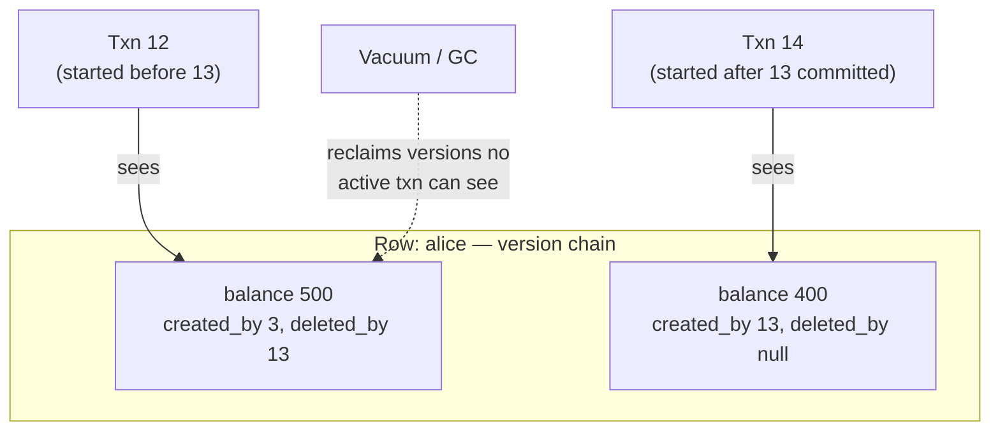

Read committed's flaw was **read skew**: a transaction's reads at different moments can observe different database states. **Snapshot isolation** fixes it with one elegant promise: *every transaction reads from a consistent snapshot of the database as it existed when the transaction began.* Mid-flight commits by others are invisible to you, no matter how long you run.

The implementation is **MVCC — Multi-Version Concurrency Control** — a generalization of read committed's two-versions-per-row into *many* versions:

1. Every transaction gets a monotonically increasing **transaction ID (txid)** at start.
2. Every row version is tagged with `created_by` (the txid that wrote it) and `deleted_by` (the txid that deleted/replaced it, if any). An UPDATE is a delete + create: the old version gets `deleted_by = my_txid`, a new version gets `created_by = my_txid`.
3. When transaction T reads, it applies **visibility rules**: a version is visible iff its creator had *committed before T started* (and it isn't deleted by such a transaction). T ignores versions from transactions that were in-flight at its start, aborted, or started later.

Old versions are garbage-collected once no active transaction can see them (Postgres calls this **vacuum**).

The payoff: **readers never block writers and writers never block readers**. Long-running queries — backups, analytics, reports — see a frozen, consistent world while writes churn underneath. This is why nearly every serious database (Postgres, MySQL/InnoDB, Oracle, SQL Server, CockroachDB) implements it.

Explain how MVCC provides snapshot isolation and what anomalies still survive it.

## Solution

```js
// ════════════════════════════════════════════
// MVCC row versions
// ════════════════════════════════════════════
// Alice's balance: $500, then a transfer of $100 by txid 13.
//
// versions of row (account = alice):
//   { balance: 500, created_by: 3,  deleted_by: 13 }  // old
//   { balance: 400, created_by: 13, deleted_by: null } // new
//
// Transaction 12 (started BEFORE 13): sees balance 500.
// Transaction 14 (started after 13 committed): sees 400.
// Nobody waited for anybody.

// ════════════════════════════════════════════
// Visibility check (the heart of MVCC)
// ════════════════════════════════════════════

function isVisible(version, txn) {
  // txn.snapshot = set of txids in-flight when txn began
  const createdVisible =
    version.created_by <= txn.id &&              // not from the future
    !txn.snapshot.inFlight(version.created_by) && // creator not still running at my start
    committed(version.created_by);                // creator actually committed

  const notDeleted =
    version.deleted_by === null ||
    txn.snapshot.inFlight(version.deleted_by) ||  // deleter hadn't committed at my start
    version.deleted_by > txn.id ||                // deleted "in my future"
    !committed(version.deleted_by);

  return createdVisible && notDeleted;
}

// A long-running backup (txid 12) keeps seeing the world as of
// its start even as txids 13..99 commit around it. Consistent
// backups + analytics for free. Read skew: dead.

// ════════════════════════════════════════════
// What SURVIVES snapshot isolation
// ════════════════════════════════════════════
// 1. LOST UPDATE — read-modify-write races:
//    T1 reads likes=10 (its snapshot), T2 reads 10 (its snapshot),
//    both write 11. Snapshots were consistent; result still wrong.
//    Fixes:
//      UPDATE posts SET likes = likes + 1;         -- atomic op
//      SELECT ... FOR UPDATE;                      -- lock the row
//      UPDATE ... WHERE likes = 10;  -- optimistic compare-and-set
//    (Postgres' REPEATABLE READ auto-detects this and aborts one;
//     MySQL's does NOT — know your engine!)
//
// 2. WRITE SKEW — T1 and T2 read the SAME data but write
//    DIFFERENT rows, jointly breaking an invariant.
//    No shared row = no conflict detected. Next lesson.
```

## Explanation

The mental model to lead with: **the database becomes append-only under the hood**. Updates never overwrite; they stack new versions tagged with transaction IDs, and each transaction wears "txid glasses" filtering the stack down to one consistent world. (Notice the rhyme with LSM trees and the WAL — *immutability plus filtering* keeps reappearing as the trick behind fast concurrent systems.)

Be precise about **naming confusion**, a favorite interview probe: snapshot isolation is what Postgres calls `REPEATABLE READ`, and Oracle (incorrectly) calls `SERIALIZABLE`. The SQL standard's levels predate MVCC and map poorly onto it.

The crucial limitation: snapshot isolation makes your **reads** perfectly consistent, but says almost nothing new about **writes**. Two patterns still bite:

- **Lost updates** — two transactions each read a value from their (valid!) snapshots, compute, and write back; one increment vanishes. Mitigations exist per-engine (atomic operations, `FOR UPDATE` locks, compare-and-set), but you must *reach* for them.
- **Write skew** — subtler and nastier: two transactions read overlapping data, then write to *different* rows, and the combination violates an invariant neither could see breaking. No write-write conflict on any single row means MVCC has nothing to detect. This anomaly is the entire next lesson, and it's the reason "snapshot isolation" ≠ "serializability."

So the honest summary for interviews: snapshot isolation buys consistent long reads at essentially no blocking cost — the right default for read-heavy systems — but any *invariant-enforcing read-then-write logic* still needs explicit locks or true serializability.

## Diagram



## ELI5

Imagine a magical library where nobody ever edits a book — authors only add *new editions*, each stamped with a number.

When you walk in, the librarian hands you glasses stamped with the current edition number. For your entire visit, your glasses only show you editions that existed **when you walked in**. An author can publish ten new editions while you're reading — you'll never notice. Your world is frozen, complete, and consistent. And the author never has to wait for you to leave, either. That's MVCC: readers and writers ignore each other completely.

But the glasses only fix what you *see*, not what you *do*. Two people wearing their own glasses can each read "cookie jar: 1 cookie left," walk to different counters, and each promise that last cookie to a different kid. Neither lied — their frozen worlds both truly showed one cookie. The jar is still over-promised.

Frozen views: solved. Coordinated *decisions*: still broken. That's write skew — next lesson.
