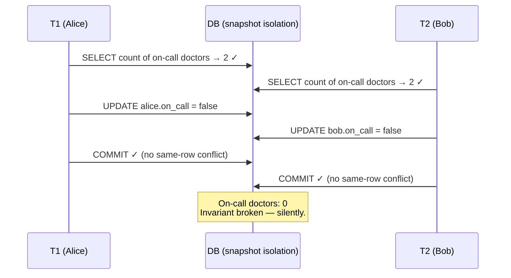

The canonical example (from *Designing Data-Intensive Applications*): a hospital requires **at least one doctor on call**. Alice and Bob are both on call tonight, both feel sick, and at the same moment both run:

```sql
BEGIN;
SELECT COUNT(*) FROM doctors WHERE on_call = true;  -- both see: 2
-- app logic: 2 >= 2, safe for one of us to leave
UPDATE doctors SET on_call = false WHERE name = 'Alice'; -- T1
UPDATE doctors SET on_call = false WHERE name = 'Bob';   -- T2
COMMIT;
```

Under snapshot isolation, **both commit**. Each read a valid snapshot (2 doctors on call ≥ 2), each updated a *different* row — no lost update, no dirty anything. Result: **zero doctors on call**. The invariant is destroyed and no anomaly the database watches for ever fired.

This is **write skew**: a generalization of the lost update where two transactions read an overlapping set of rows, then write **disjoint** rows, and the *combination* of writes violates an invariant. The database only detects conflicts on the *same row* — here there are none.

The pattern generalizes frighteningly well: booking the last meeting room slot, two users claiming the same username, double-spending account credit, exceeding an event's capacity — anything of the form **"check a condition, then write based on it."**

**Phantoms** make it worse. In room booking, the check is `SELECT ... WHERE room=101 AND overlaps(time)` hoping to find *nothing* — and the write **INSERTs a new row**. There's no row to lock at read time: the conflicting row doesn't exist yet. A write that changes the result of another transaction's earlier query is a **phantom write**.

Explain write skew, why snapshot isolation can't catch it, and the available defenses.

## Solution

```js
// ════════════════════════════════════════════
// The shape of every write-skew bug
// ════════════════════════════════════════════
// 1. SELECT to check an invariant   (count, existence, sum…)
// 2. App code decides based on result
// 3. Write something that INVALIDATES step 1 for others
//
// Two interleaved runs: both step-1 checks pass on the old
// state; the two writes together break the rule.

// ════════════════════════════════════════════
// Defense 1: lock the rows you based your decision on
// ════════════════════════════════════════════
// BEGIN;
// SELECT * FROM doctors WHERE on_call = true FOR UPDATE;  -- 🔒 both rows
// -- T2's identical SELECT now BLOCKS until T1 commits,
// -- then re-reads: sees 1 doctor on call → app refuses.
// UPDATE doctors SET on_call = false WHERE name = 'Alice';
// COMMIT;
// Works when the decision rows EXIST. Cost: serializes these txns.

// ════════════════════════════════════════════
// Defense 2: phantoms — there is NOTHING to lock
// ════════════════════════════════════════════
// Meeting room booking:
// SELECT count(*) FROM bookings
//   WHERE room=101 AND start<'15:00' AND end>'14:00';  -- hope: 0
// INSERT INTO bookings VALUES (101, '14:00', '15:00'); -- new row!
//
// FOR UPDATE on zero rows locks zero rows. Both inserts land.
//
// Fix: MATERIALIZE THE CONFLICT — create rows representing the
// contested resource, purely as lock targets:
//
// CREATE TABLE room_slots (room_id INT, slot TIMESTAMP);
//   -- pre-populated: every room × every 15-min slot
//
// BEGIN;
// SELECT * FROM room_slots
//   WHERE room_id=101 AND slot BETWEEN '14:00' AND '14:45'
//   FOR UPDATE;                      -- 🔒 now there IS something to lock
// -- check bookings, then insert
// COMMIT;

// ════════════════════════════════════════════
// Defense 3 (often best): a UNIQUE constraint
// ════════════════════════════════════════════
// Claiming usernames? Don't SELECT-then-INSERT. Just:
//   INSERT INTO users(username) VALUES ('tom');  -- unique index
// Second txn gets a constraint violation. Let the DB be the referee.

// ════════════════════════════════════════════
// Defense 4: run at a truly SERIALIZABLE level
// ════════════════════════════════════════════
// Postgres: SET TRANSACTION ISOLATION LEVEL SERIALIZABLE;
// One of the two txns aborts with a serialization error → retry it.
// (How this works: the next three lessons.)
```

## Explanation

Write skew is the interview topic that separates people who've memorized isolation levels from people who understand them. The key sentence: **snapshot isolation detects conflicts on writes to the same object; write skew's conflict lives in the *relationship between a read and someone else's write*** — T2's write invalidates the premise of T1's read. Since premise-tracking is expensive, MVCC simply doesn't do it.

Notice how the anomalies you've collected form a ladder:
- **Dirty write** — same row, uncommitted overwrite (killed by read committed)
- **Lost update** — same row, read-modify-write race (killed by SI + engine help)
- **Write skew** — *different* rows, shared premise (survives SI!)
- **Phantom** — the premise is about rows that *don't exist yet* (nothing to lock)

Choosing a defense is a genuine design decision. **Unique constraints** are the cleanest when the invariant maps to uniqueness (usernames, one-booking-per-slot). **`SELECT FOR UPDATE`** works when the premise rows exist, at the cost of serializing hot paths (fine for doctors; dangerous for a ticket-sales flash sale). **Materializing conflicts** — pre-creating slot rows to serve as lock handles — is the classic fix for phantoms, though DDIA rightly calls it ugly and last-resort: your schema now contains rows that exist only for locking, and application correctness depends on remembering to lock them. **Serializable isolation** is the principled answer, and modern implementations (SSI, lesson 13) make it far cheaper than its reputation suggests.

When asked "design a booking system," this is *the* correctness discussion the interviewer is fishing for — raise it before they do.

## Diagram



## ELI5

Two roommates, one rule: **someone must stay home with the dog.**

At 3pm, roommate A peeks in the living room: "B is home — I can go out." At the same moment, B peeks into A's room: "A is home — I can go out." Both grab their coats. Both checks were *true when made*. Nobody "overwrote" anybody — A wrote on A's calendar, B wrote on B's. And now the dog is home alone.

That's write skew: two decisions, each based on a true glimpse of the other, that are only wrong *together*. The database can't object — no one touched the same calendar.

Fixes, roommate-style:
- **Lock what you looked at:** before leaving, you must hold the shared house key while deciding (`FOR UPDATE`) — the other person's check waits, then sees you're gone.
- **The phantom problem:** what if the rule is "no two parties booked on the same night" and neither party *exists yet*? You can't lock a party nobody's planned. So you hang a calendar with a slot for every night (materializing the conflict) — to book, you must write your name in that night's slot, and only one name fits.
- **Or hire a referee** (serializable isolation) who watches everyone's peeks and vetoes the second coat-grab.
