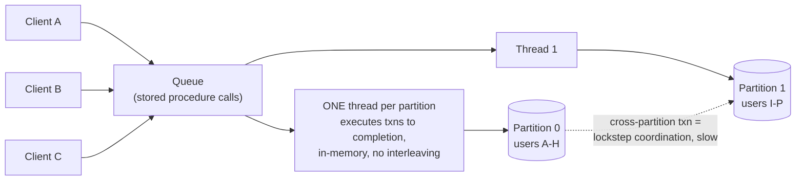

Every anomaly in the previous lessons — lost updates, read skew, write skew, phantoms — exists because transactions **interleave**. The most direct fix imaginable: **don't interleave**. Execute every transaction, start to finish, one at a time, on a single thread. Serializability isn't approximated — it's *literal*.

For decades this was considered absurd (throughput!). Two hardware shifts made it real, and **VoltDB/H-Store**, **Redis**, and **Datomic** bet on it:

1. **RAM got cheap** — the active dataset fits in memory, so a transaction needs no disk waits.
2. OLTP transactions turned out to be **tiny** — a handful of reads and writes, microseconds each when data is in RAM.

But one requirement is non-negotiable: **no interactive transactions**. A typical app transaction goes: query → network hop to app → app thinks → query again → ... With one execution lane, everyone queues behind that transaction's *network round-trips* — catastrophic. So serial-execution systems require **stored procedures**: ship the *entire transaction logic* to the database in one shot; it executes with zero external waits.

Scaling past one core: **partition the data** — each partition gets its own serial thread (VoltDB's model). Single-partition transactions fly; cross-partition ones need coordination across threads and are dramatically slower (~orders of magnitude), so schema design becomes partition-boundary design.

Explain when literal serial execution works, why stored procedures are mandatory, and its scaling limits.

## Solution

```js
// ════════════════════════════════════════════
// The entire concurrency model
// ════════════════════════════════════════════

const queue = [];        // transactions waiting their turn

async function serialExecutor() {
  while (true) {
    const txn = await queue.next();
    txn.execute();       // runs COMPLETELY — no locks, no MVCC,
                         // no interleaving, no anomalies. Period.
  }
}

// No dirty reads, no write skew, no phantoms, no deadlocks —
// there is nothing to race against.

// ════════════════════════════════════════════
// Why interactive transactions are forbidden
// ════════════════════════════════════════════
// Interactive (app ↔ DB ping-pong):
//   BEGIN → [network 0.5ms] → SELECT → [network] → app logic
//   → [network] → UPDATE → [network] → COMMIT
//   ≈ milliseconds of the ONE lane blocked by... waiting.
//
// Stored procedure (everything ships at once):
queue.push({
  procedure: 'transfer',            // pre-registered logic
  args: { from: 'alice', to: 'bob', amount: 100 },
});
//   executes in ~10µs of pure in-memory work. 100k+ txns/sec.
// (Redis: MULTI/EXEC and Lua scripts are exactly this idea.)

// ════════════════════════════════════════════
// Scaling: one serial lane PER PARTITION
// ════════════════════════════════════════════
// Partition by user_id:
//   P0: users A-H    → thread 0
//   P1: users I-P    → thread 1
//   P2: users Q-Z    → thread 2
//
// transfer(alice → bob):   same partition → one thread, fast ✓
// transfer(alice → zach):  TWO partitions → both threads must
//   coordinate in lockstep (cross-partition txn) → ~10-100x slower.
// Design the schema so hot transactions stay single-partition.

// ════════════════════════════════════════════
// The checklist: serial execution fits IFF
// ════════════════════════════════════════════
// ✓ active dataset fits in RAM
// ✓ transactions are short (no human/API waits inside)
// ✓ throughput ≤ one core per partition can absorb
// ✓ workload partitions cleanly (few cross-partition txns)
// ✗ long analytics queries in the same lane? Forget it.
```

## Explanation

The insight worth quoting: **concurrency control exists to hide *waiting*** — for disks and for network round-trips. Traditional databases interleave transactions because most of a transaction's wall-clock time was I/O stalls; interleaving keeps the CPU busy during them. Remove the waits (RAM-resident data + stored procedures) and there's nothing left to hide — a single core grinding through microsecond transactions back-to-back beats a lock manager coordinating hundreds of interleaved ones. All the machinery of the previous lessons (row locks, MVCC visibility rules) plus the next two (2PL, SSI) simply *vanishes*.

Redis is the example everyone already uses without realizing: its single-threaded command loop is why `INCR`, `MULTI/EXEC`, and Lua scripts are atomic *by construction* — there is no concurrent execution to isolate against.

The honest costs, for when an interviewer pushes: one slow transaction stalls **everyone** behind it (a single accidental full-scan is an outage); throughput is hard-capped by one core per partition; stored procedures are harder to develop, version, and debug than app-side logic; and cross-partition transactions reintroduce — in worse form — the coordination the model was built to escape.

Framing for the chapter: serializability has exactly three practical implementations, and this is the first — *eliminate concurrency*. The next two keep concurrency and tame it instead: **two-phase locking** (pessimistic — block conflicts before they happen) and **serializable snapshot isolation** (optimistic — let transactions run, abort the ones that conflicted).

## Diagram



## ELI5

All the drama of the last four lessons came from many cooks sharing one kitchen. Serial execution says: **one cook**. One person makes every dish, start to finish, one at a time. Nobody grabs the same pan, nobody's recipe gets scrambled — every "race condition" is definitionally impossible.

Insane? Only if dishes are slow. The trick is that each dish takes *seconds* (all ingredients pre-chopped, within arm's reach — data in RAM), and one crucial house rule: **you must hand the cook the complete recipe card up front** (stored procedure). No "start the sauce, then phone me and I'll tell you what's next" — one customer's phone call would freeze the entire restaurant's queue (an interactive transaction hogging the lane).

Need more throughput? Open a second kitchen with its own cook and its own pantry — Italian dishes here, sushi there (partitioning). Blazing fast, until someone orders a dish needing ingredients from *both* pantries: now two cooks must work in lockstep, and everything behind them waits.

One cook, complete recipes, pre-stocked pantries: that's Redis and VoltDB.
