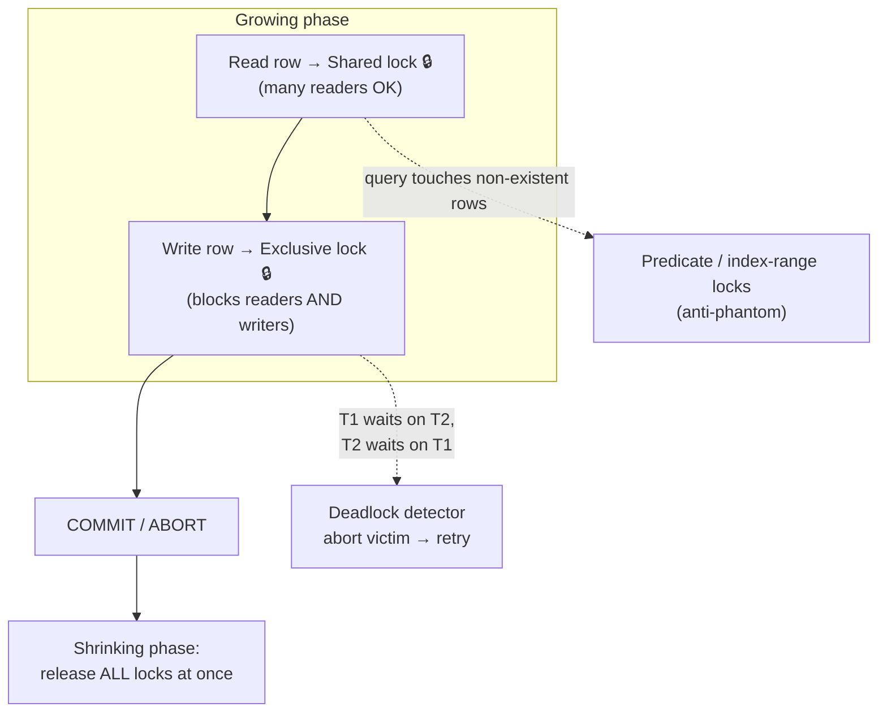

**Two-phase locking** was *the* serializability algorithm for ~30 years (IBM DB2, SQL Server at SERIALIZABLE). Where serial execution eliminates concurrency, 2PL permits it but forces conflicting transactions to **wait**.

(Don't confuse with two-phase *commit* — 2PC is about distributed atomicity, a different lesson entirely.)

**The locking rules.** Every object carries a lock with two modes:
- **Shared (S)** — for reading. Many transactions may hold S simultaneously.
- **Exclusive (X)** — for writing. Exactly one holder; conflicts with everything, *including S*.

That last clause is what distinguishes 2PL from everything before it: **readers block writers, and writers block readers**. (Snapshot isolation's motto — "readers and writers never block each other" — is precisely what 2PL sacrifices. That blocking is also exactly what kills write skew: you can't build a decision on data someone else is changing.)

**The two phases:**
1. **Growing** — the transaction acquires locks as it touches objects (S to read, X to write; S may be *upgraded* to X).
2. **Shrinking** — all locks are released **only at commit/abort**, never earlier.

Why never release early? Release a lock mid-transaction, let someone write that object, and your earlier read may now be a lie — the premise problem from write skew all over again. Holding everything until commit makes the serial order provable.

**Phantoms need special weapons.** You can't lock a row that doesn't exist. 2PL adds **predicate locks** (lock the *condition* — "room 101, 2-3pm" — against future inserts) or, practically, **index-range locks** (lock a range in the index, e.g. all of room 101's slice — coarser but far cheaper).

Explain 2PL's rules, how it handles phantoms, deadlocks, and why its performance hurts.

## Solution

```js
// ════════════════════════════════════════════
// Lock manager (conceptual)
// ════════════════════════════════════════════

class LockManager {
  locks = new Map(); // object -> { mode, holders, waitQueue }

  acquire(txn, object, mode) {
    const lock = this.locks.get(object) ?? this.newLock(object);

    const compatible =
      lock.holders.size === 0 ||
      (mode === 'S' && lock.mode === 'S');       // S+S coexist only

    if (compatible) {
      lock.holders.add(txn); lock.mode = mode;
      txn.heldLocks.add(object);                 // growing phase
    } else {
      lock.waitQueue.push({ txn, mode });        // BLOCK. Maybe forever…
      this.detectDeadlock(txn);
    }
  }

  releaseAll(txn) {
    // Shrinking phase: ONLY here, at commit/abort. Never earlier.
    for (const obj of txn.heldLocks) this.release(txn, obj);
  }

  detectDeadlock(txn) {
    // T1 holds A, wants B; T2 holds B, wants A → cycle in the
    // waits-for graph. Nobody can ever proceed.
    if (this.waitsForGraph().hasCycle()) {
      const victim = this.pickVictim();  // e.g. youngest txn
      victim.abort();                    // app must RETRY it
    }
  }
}

// ════════════════════════════════════════════
// Write skew: dead on arrival under 2PL
// ════════════════════════════════════════════
// T1: SELECT on-call doctors        → S-locks alice & bob rows
// T2: SELECT on-call doctors        → S-locks succeed (S+S ok)
// T1: UPDATE alice → needs X on alice → BLOCKED (T2 holds S)
// T2: UPDATE bob   → needs X on bob   → BLOCKED (T1 holds S)
// ☠ Deadlock! Detector kills T2; T1 completes; T2 retries and
//   sees only 1 doctor on call → correctly refuses. Invariant saved.

// ════════════════════════════════════════════
// Phantoms: index-range locks
// ════════════════════════════════════════════
// SELECT * FROM bookings WHERE room=101 AND time && '2-3pm';
//   → lock the room=101 range IN THE INDEX. A later
//     INSERT (101, 2:30pm) must acquire a conflicting lock → waits.
//   No matching index? Fall back to locking the whole table. Ouch.

// ════════════════════════════════════════════
// Why 2PL hurts
// ════════════════════════════════════════════
// - Readers block writers & vice versa → long analytics query
//   freezes all writes to what it scans.
// - Tail latency: one slow txn cascades through the wait graph.
// - Deadlocks are NORMAL operation → apps must implement retry.
// - Lock manager bookkeeping on every single access.
```

## Explanation

2PL is **pessimism codified**: assume conflict is likely, make everyone announce intentions (locks) up front, and force waiting when intentions clash. It provably yields serializability — the commit order of transactions is a valid serial order, because holding all locks to commit means no one ever observed your intermediate state or invalidated your premises.

The write-skew walkthrough in the solution is worth rehearsing verbatim for interviews — it shows *mechanically* why the doctors bug can't survive: shared locks on the rows you read mean anyone trying to change them collides with you. Often the collision manifests as a **deadlock**, and this is the counterintuitive part worth saying out loud: *deadlock-then-retry isn't 2PL failing; it's 2PL working* — the retry is what re-checks the invariant.

The performance story is why the industry moved on. Under 2PL, **read-write contention becomes wait time**: a 5-minute reporting query S-locks everything it scans, stalling every write behind it; a stalled write X-lock stalls every reader of that row; waits chain into convoys. Throughput collapses not on average but at the **tail** — and unstable tail latency is the cardinal sin in modern systems. Add per-access lock-manager overhead and mandatory deadlock handling, and you see why Postgres, when asked for SERIALIZABLE, chose a different path.

That path is the next lesson: **serializable snapshot isolation** flips the bet — *optimism*. Let transactions run without blocking (on MVCC snapshots), track the read/write dependencies that 2PL would have blocked on, and abort at commit only those that actually conflicted. Same guarantee, waiting replaced by retries.

## Diagram



## ELI5

The library got strict. New rules:

- Want to **read** a book? Clip your blue clothespin to it. Any number of blue pins can share a book (shared locks).
- Want to **rewrite** a page? You need the single red clothespin for that book — and it's only issued when *no other pins* are on it, blue included (exclusive lock).
- And the golden rule: **you keep every pin until you walk out the door** (commit). No returning pins early — someone might rewrite a book you already read and quoted in your essay.

Watch the roommate/doctor bug die: you blue-pin the dog-sitting schedule; your roommate blue-pins it too. You try to red-pin your own calendar to write "going out" — but wait, changing plans requires red-pinning the *schedule* you both read. You block on their blue pin; they block on yours. Gridlock! The librarian (deadlock detector) taps one of you: "Out. Come back and start over." On retry, you see their committed change — and stay home with the dog. The rule survives.

The cost is obvious in the metaphor: someone reading a book for five hours holds blue pins that block every writer, who then block every other reader. Lots of standing around. The next lesson fires the clothespins and hires a security camera instead.
