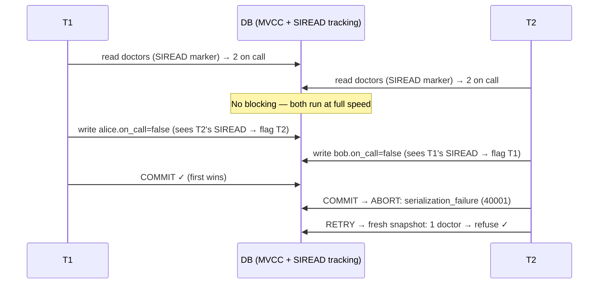

The finale of the isolation saga. Recap the two roads to serializability so far: **serial execution** (eliminate concurrency — needs tiny in-RAM transactions) and **2PL** (pessimistic blocking — correctness paid for with waiting and deadlocks). **Serializable Snapshot Isolation** is the modern third road, and the one you're most likely running: it became Postgres's `SERIALIZABLE` in 9.1 (2011) and underpins CockroachDB.

The idea: transactions execute under plain **snapshot isolation** — full speed, MVCC snapshots, no read locks, nobody blocks. Meanwhile the database **tracks dependencies**, and at commit time asks: *"did this transaction act on a premise that another transaction invalidated?"* If so — **abort it and retry**. Optimism instead of pessimism: 2PL prevents conflicts by making everyone wait as if conflict were certain; SSI lets everyone run and charges only the actual conflicts.

Recall why snapshot isolation admits write skew: a transaction reads data (its *premise* — "2 doctors on call"), decides, writes. Concurrently, someone changes the premise; by commit, the decision is based on stale facts. SSI detects exactly the two ways this happens:

1. **Reading a version that got overwritten**: T1 read row X; by the time T1 commits, T2 has committed a new version of X. T1's premise *may* be stale → abort T1 at commit.
2. **Writing what someone already read** (detecting reads *after* the fact): when T2 writes row X, the database checks an "SIREAD" record — who recently *read* X under a snapshot? Those readers' premises just changed → whichever commits second gets aborted.

Only **write-transactions with invalidated premises** abort; read-only transactions never block writers and (mostly) never abort.

Explain how SSI works, its trade-offs vs 2PL, and when its optimism backfires.

## Solution

```js
// ════════════════════════════════════════════
// SSI = MVCC + rw-dependency tracking
// ════════════════════════════════════════════

class SSITransaction {
  readSet = new Set();   // rows this txn read  (SIREAD "locks" — no blocking!)
  writeSet = new Set();  // rows this txn wrote
  premiseInvalidated = false;

  read(row) {
    row.siread.add(this);            // leave a marker: "I read this"
    return row.versionVisibleTo(this); // plain MVCC snapshot read
  }

  write(row, value) {
    // Detection case 2: who READ the version I'm replacing?
    for (const reader of row.siread) {
      if (reader.isConcurrentWith(this)) {
        reader.premiseInvalidated = true;  // their read is now stale
        // (track as rw-dependency; abort happens at commit time)
      }
    }
    this.writeSet.add(row);
    row.stageNewVersion(this, value);
  }

  commit() {
    // Detection case 1: did anyone commit a write to something I read?
    if (this.premiseInvalidated && this.writeSet.size > 0) {
      throw new SerializationError('retry me'); // 40001 in Postgres
    }
    commitVersions(this.writeSet);
  }
}

// ════════════════════════════════════════════
// The doctors, one last time — under SSI
// ════════════════════════════════════════════
// T1 reads doctors (SIREAD markers on alice & bob rows)
// T2 reads doctors (SIREAD markers too)          — nobody blocks!
// T1 writes alice.on_call=false  → sees T2's SIREAD → flags T2
// T2 writes bob.on_call=false    → sees T1's SIREAD → flags T1
// T1 commits first → OK ✓
// T2 commits → premise invalidated + it wrote → ABORT 💥
// App retries T2 → fresh snapshot shows 1 doctor → refuses. ✓
//
// Same outcome as 2PL, but T1 and T2 ran at FULL SPEED —
// the price was one retry, paid only because a real conflict existed.

// ════════════════════════════════════════════
// The comparison table you should be able to draw
// ════════════════════════════════════════════
// serial execution | no concurrency    | RAM-sized, tiny txns only
// 2PL              | pessimistic block | waits, deadlocks, tail pain
// SSI              | optimistic abort  | retries; wasted work if hot
//
// SSI's failure mode: HIGH CONTENTION. If everyone reads and
// writes the same hot rows, most txns abort at commit → work
// done twice or thrice. Pessimism (or queueing, or sharding
// the hot key) wins there. Also: false positives — SSI tracks
// at row/page granularity and aborts some txns that were fine.
```

## Explanation

SSI resolves the tension that ran through this whole chapter. Snapshot isolation gave blazing reads but let write skew through, because nobody watched whether a transaction's *premises* (what it read) still held at commit. 2PL watched premises by locking them — turning every potential conflict into guaranteed waiting. SSI watches premises **without locking**: SIREAD markers are pure bookkeeping ("T1 read this"), never blocking anyone; the rw-dependency check at commit converts *actual* conflicts — and only those — into aborts.

Why this wins in practice: conflicts are **rare** in most real workloads. Charging every transaction lock-wait overhead to prevent conflicts that mostly wouldn't happen (2PL) is a bad trade when you can instead charge only the conflicting minority a retry. Under low contention, SSI benchmarks close to plain snapshot isolation — which is why "just use `SERIALIZABLE` in Postgres" is much more reasonable advice than folklore suggests. Bonus subtlety: a theoretical wrinkle means SSI can abort transactions that were technically serializable (false positives from coarse-grained tracking) — the guarantee is one-directional: nothing non-serializable ever commits.

Two production notes that signal experience: **your app must retry** — Postgres throws error 40001 (`serialization_failure`), and a retry loop around serializable transactions is mandatory, not optional. And **keep transactions short** — a long-running transaction accumulates a giant read set, becomes a magnet for rw-conflicts, and forces Postgres to retain SIREAD bookkeeping for its whole lifetime.

Chapter closed: you now hold the complete isolation toolbox — read committed → snapshot isolation → the write-skew gap → and three ways to close it (serial, 2PL, SSI), each with a articulable trade-off. That's precisely the depth "deep dives" in a systems interview are probing for.

## Diagram



## ELI5

Same library, new policy. The strict clothespins are gone — everyone reads and writes at full speed again, like the magic-glasses days. But now there's a **security camera**.

The camera doesn't stop anyone. It just quietly notes: "Tom read the dog-sitting schedule at 3:01. Anna read it at 3:02. Tom changed his calendar at 3:03. Anna changed hers at 3:04."

The check happens at the **exit door**. Tom leaves first — camera review: the schedule he based his decision on was still true when he read it, and he committed first. Approved. Anna reaches the door — camera review: "You decided based on the schedule, but Tom *changed the situation* after you read it. Your decision used stale facts. **Go back and redo it.**" Anna re-enters, sees Tom already left, stays home with the dog.

Compare the three guards you've now met: the **one-at-a-time door** (serial execution — nobody overlaps, ever), the **clothespin librarian** (2PL — everyone waits whenever they *might* clash), and the **camera** (SSI — nobody waits; the rare person whose facts went stale redoes their visit). When clashes are rare, the camera is gloriously cheap. When everyone's fighting over one book all day, people get bounced from the exit over and over — and the clothespins start looking good again.
