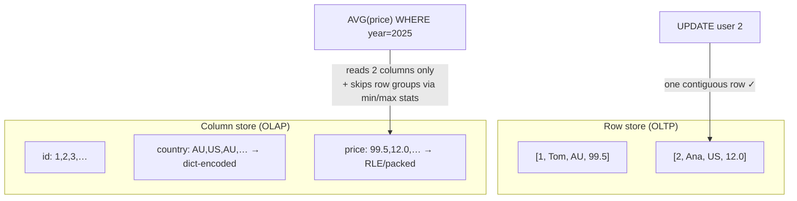

Everything so far assumed **OLTP** — transaction processing: fetch *one user*, update *one order*. Rows are the natural unit, so Postgres, MySQL, and Cassandra store each row's values **together**. But analytics — **OLAP** — asks a different shape of question:

```sql
SELECT AVG(price) FROM sales WHERE year = 2025;
-- 2 columns touched. The table has 100. Billions of rows.
```

A row store must read entire rows off disk — all 100 columns — to use 2 of them. 98% of the I/O is waste, and indexes barely help a query that touches most rows anyway.

**Column-oriented storage** flips the layout: store all values of *each column* together — the `price` file, the `year` file, ... Now that query reads exactly 2 columns' worth of data. Row *i* is implicit: it's the *i*-th entry of every column file.

The layout unlocks two multipliers:

**1. Compression.** A column is millions of same-typed, often-repetitive values — a compressor's dream:
- **Run-length encoding**: sorted `year` column `2024 ×1M, 2025 ×1M` → two pairs.
- **Dictionary + bit-packing**: `country` has 195 distinct values → store each as 8 bits, not a 20-byte string.

10-100x compression is routine — less disk, less I/O, more of the dataset fits in RAM.

**2. Vectorized execution.** Dense arrays of one type let the engine process values in tight loops / SIMD instructions over thousands at a time, instead of interpreting row-by-row.

**Parquet** is the open standard file format built on these ideas (plus twists from Google's Dremel for nested data), used by Spark, Athena, BigQuery, DuckDB, and every data lake.

Explain row vs column layout, why columns compress so well, and Parquet's structure.

## Solution

```js
// ════════════════════════════════════════════
// Same data, two layouts
// ════════════════════════════════════════════

// ROW-ORIENTED (OLTP: Postgres, MySQL)
// disk: [1,'Tom','AU',99.5] [2,'Ana','US',12.0] [3,'Kim','AU',45.0]
// get user 2        → one contiguous read ✓
// AVG(price)        → read EVERYTHING, keep 1 field per row ✗

// COLUMN-ORIENTED (OLAP: Snowflake, Redshift, Parquet files)
// id:      [1, 2, 3, ...]
// name:    ['Tom', 'Ana', 'Kim', ...]
// country: ['AU', 'US', 'AU', ...]
// price:   [99.5, 12.0, 45.0, ...]
// AVG(price)        → read ONLY the price file ✓
// get user 2        → reassemble from N files ✗ (row i = i-th of each)

// ════════════════════════════════════════════
// Why columns compress absurdly well
// ════════════════════════════════════════════

// Run-length encoding (sorted/low-cardinality columns):
//   ['AU','AU','AU','US','US'] → [['AU',3], ['US',2]]

// Dictionary encoding + bit-packing:
//   dict: { 0:'AU', 1:'US', 2:'VN' }        // 195 countries max
//   data: [0,0,0,1,1,2,...]                  // 8 bits per value
//   vs raw strings: ~20 bytes per value → 20x smaller

// ════════════════════════════════════════════
// Parquet file anatomy
// ════════════════════════════════════════════
// file.parquet
// ├── Row group 0            (e.g. 128MB horizontal slice of rows)
// │   ├── column chunk: id      (compressed pages + stats)
// │   ├── column chunk: country (dictionary-encoded)
// │   └── column chunk: price   (min=1.2, max=999 ← statistics!)
// ├── Row group 1
// │   └── ...
// └── Footer: schema + per-chunk offsets & min/max stats

// The two pruning tricks every query engine uses:
// 1. COLUMN PRUNING: SELECT price → read only price chunks.
// 2. PREDICATE PUSHDOWN: WHERE price > 500 → skip any row group
//    whose footer says max(price)=499. Entire GBs never read.

// ════════════════════════════════════════════
// The trade-offs
// ════════════════════════════════════════════
// ✗ Point lookups/updates: one row is scattered across files.
// ✗ Writes: can't append one row cheaply to N sorted compressed
//   files → batch writes, LSM-style buffering (or rewrite files).
// → OLTP DB for the app + nightly/streaming ETL into Parquet
//   for the warehouse: the standard two-system architecture.
```

## Explanation

The deepest way to frame it: **storage layout should match the axis of your access pattern.** OLTP slices data *horizontally* (one entity, all its attributes); OLAP slices *vertically* (one attribute, all entities). No single layout serves both masters, which is why real architectures run both: an OLTP row store for the product, and a column store (or Parquet-on-S3 data lake) fed by ETL/CDC for analytics. Saying that sentence in an interview — with *why* — covers the "how do we do analytics?" follow-up in nearly any design.

Compression here isn't just a storage saving — it's a **speed multiplier**, because analytics queries are I/O-bound: 20x smaller data is 20x fewer bytes off disk, and decompression is cheaper than the reads it avoids. Even better, engines often operate *directly on compressed data* (comparing dictionary codes, skipping RLE runs) without decompressing. Add **sort order** on a chosen column (e.g., date) and you compound the wins: run-length encoding shines and time-range predicates prune whole row groups via footer min/max statistics.

Parquet's hybrid design is a subtle point worth landing: it's not purely columnar — it first slices rows into **row groups**, then stores columns *within* each group. This keeps any given row's values in the same file region (bounded reassembly cost) while preserving columnar reads and pruning. Notice also the writes story rhymes with LSM trees: immutable, batch-written files with statistics-guided reads — the same ideas from lesson 5 in analytics clothing.

## Diagram



## ELI5

Your school stores every student's info on paper cards — one card per student: name, grade, height, favorite color... Grabbing *Ana's whole card* is instant. That's a row store, and it's perfect for the front office.

Now the principal asks: **"What's the average height of all 2,000 students?"** You must pull out all 2,000 cards and squint at one line on each. Almost everything you read is irrelevant.

The column-store trick: keep *lists* instead of cards. One notebook with just heights, one with just grades, one with just favorite colors. Average height = read one notebook, front to back. Done.

Bonus: the notebooks are hilariously easy to shrink. The colors notebook says "blue ×612, red ×580..." instead of writing "blue" six hundred times (run-length encoding). And Parquet notebooks print a little summary on each chapter's first page — "heights in this chapter: 120-145cm" — so a search for "taller than 180" skips whole chapters unopened (predicate pushdown).

The price: rebuilding *Ana's full card* now means visiting every notebook for her line — slow. So the school keeps both: cards at the front desk for daily business, notebooks in the research office for the principal's questions. Every real company does exactly this.
