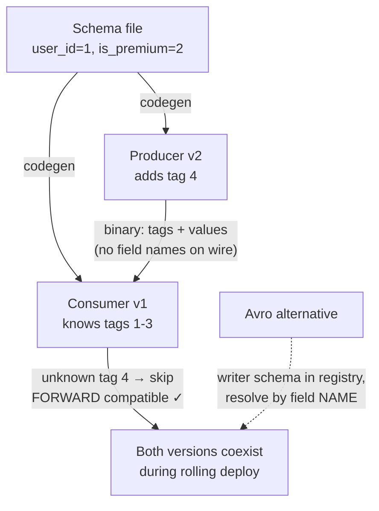

Every byte that leaves a process — API responses, queue messages, files, cache entries — must be **encoded** (serialized). Most teams default to JSON and never think again. At scale, that default gets expensive:

```json
{"userId": 12345, "isPremium": true, "interests": ["coding", "chess"]}
```

- **Field names ship in every message.** `"userId"` — 8 bytes — repeated in each of a billion events. Often the labels outweigh the data.
- **No real types.** Is `12345` an int32, int64, float? (JavaScript: everything's a float — ints above 2⁵³ silently corrupt.) No binary strings without base64 (+33%).
- **No schema.** The contract between producer and consumer lives in tribal knowledge; renaming a field breaks consumers at runtime.

**Binary serialization frameworks** fix all three by making the schema explicit and shipping *no field names at all*:

**Protocol Buffers (Google) / Thrift (Facebook)** — fields get **numeric tags** in a schema file; the wire format is just `tag → typed value` pairs. `userId` becomes tag `1` — one byte instead of eight. Codegen produces typed classes for every language.

**Avro (Hadoop ecosystem)** — no tags at all: the writer's schema determines exact field *order*, and the wire holds only raw values — smallest of all. The reader resolves differences between the **writer's schema** (attached to the file, or referenced from a schema registry) and its own **reader's schema** by matching field *names*.

The deeper payoff isn't size — it's **schema evolution**: precise rules for changing schemas so old and new code interoperate, which is a *deployment* superpower.

Explain why binary formats beat JSON at scale and how each framework handles schema evolution.

## Solution

```js
// ════════════════════════════════════════════
// Protobuf: schema with numeric field tags
// ════════════════════════════════════════════
// message User {
//   int64  user_id    = 1;   // ← the tag IS the field's identity
//   bool   is_premium = 2;   //   names never touch the wire
//   repeated string interests = 3;
// }
//
// Wire: [tag1|varint] 12345 [tag2|bool] 1 [tag3|len] "coding"...
// ≈ 25 bytes vs ~70 for JSON. Varints: small ints = 1 byte.

// ════════════════════════════════════════════
// Schema evolution rules (Protobuf/Thrift)
// ════════════════════════════════════════════
// FORWARD compat (old code reads NEW data):
//   old reader hits unknown tag 4 → SKIPS it (length is known).
// BACKWARD compat (new code reads OLD data):
//   tag 4 absent → field gets default value. So: new fields
//   must be OPTIONAL or have defaults.
// NEVER: reuse or renumber a tag — tag 2 means "is_premium"
//   in every byte ever written. Renaming is FREE (names ≠ wire).

// ════════════════════════════════════════════
// Avro: no tags — schema resolution instead
// ════════════════════════════════════════════
// Writer schema v1: {name: string, fav_number: int}
// Wire: ["Tom", 7]        ← pure values, in schema order. Tiny.
//
// Reader schema v2 also has fav_color (default "red"):
//   resolve by FIELD NAME: name→name, fav_number→fav_number,
//   fav_color missing in data → default "red".
// Where does the reader get the writer's schema?
//   - files: embedded once in the header (millions of records amortize it)
//   - streams (Kafka): schema REGISTRY id in each message
// Bonus: no codegen needed → friendly to dynamic languages
//   and schemas generated from database tables.

// ════════════════════════════════════════════
// Decision guide
// ════════════════════════════════════════════
// Public / browser-facing API      → JSON (universal, debuggable)
// Internal microservice RPC        → Protobuf (usually via gRPC)
// Kafka events / data lake records → Avro + schema registry
// Analytics files at rest          → Parquet (columnar, last lesson)
//
// The size math that sells it:
// 1B events/day × 70B JSON  = 70 GB/day moved & stored
// 1B events/day × 25B proto = 25 GB/day  (and ~5x faster to parse:
// no text scanning, no key hashing, no number parsing)
```

## Explanation

The throwaway line "services talk JSON" hides two real costs: **bytes** (field names + text encoding, multiplied by billions of messages across network, disk, and cache) and — the one that bites harder — **contract drift**: with no schema, nothing stops a producer change from breaking consumers, and you find out in production.

The design divergence between the frameworks is a great interview thread. **Protobuf/Thrift** make the *tag* the identity: names are development-time sugar, so renames are free, but tags are forever — the schema file accretes `reserved` graveyards. **Avro** makes the *name* the identity and achieves the smallest encoding by shipping zero per-field metadata — but that means the reader *must* obtain the exact writer's schema (embedded in file headers, or via a schema registry for Kafka), adding a moving part. Avro's no-codegen, no-tag design is specifically friendlier to dynamically generated schemas — e.g., dumping database tables whose columns change.

Why interviews care about evolution rules: **rolling deploys**. During any deployment — and forever, in stored data — old readers meet new data and new readers meet old data (data outlives code!). Binary frameworks turn "hope nobody broke the contract" into checkable rules — new fields optional-with-defaults, never renumber tags — that a schema registry can *enforce in CI*, rejecting incompatible schemas before they ship.

This closes the course's arc deliberately: indexes shaped how data is *found*, transactions how it's *changed safely*, column stores how it's *analyzed*, and serialization how it *moves between systems* — which is exactly where the playlist goes next: replication, moving data between *databases*.

## Diagram



## ELI5

Sending JSON is like mailing a form where every blank is relabeled by hand, every time: "FIRST NAME: Tom. LAST NAME: Le. AGE: 30." A billion letters a day, and half the ink is spent rewriting the labels everyone already knows.

**Protobuf's trick:** both sides agree on a numbered form up front — box 1 is first name, box 2 is last name. Now letters just say "①Tom ②Le ③30." Tiny. If HQ adds box 4 ("favorite pizza") and your office's form only goes to 3, no problem — you skip box 4 (forward compatibility). If you receive an old letter without box 4, you pencil in the default (backward compatibility). One iron rule: **never renumber the boxes** — box 2 must mean "last name" until the end of time.

**Avro's trick** goes further: no box numbers at all — values arrive in agreed order, "Tom Le 30," and you consult the sender's form definition (filed once per mailbag, or kept in a shared registry binder) to know what's what. Smallest letters possible; the price is you must always be able to look up the sender's form.

Why grown-ups care: during a deploy, half your servers run yesterday's code and half run today's — and yesterday's letters sit in queues and files forever. Numbered boxes and registry binders are what let old and new understand each other, safely, by rule instead of by luck.
